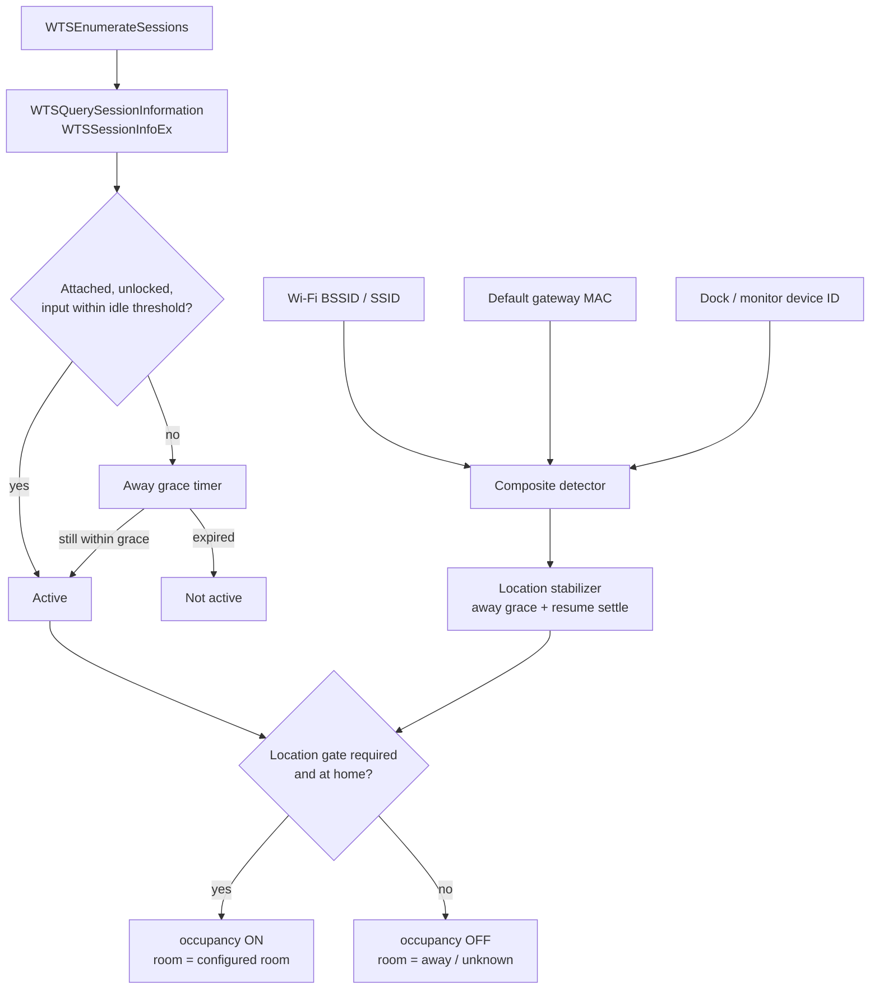

# HA Active User for Windows

A Windows service that turns "someone is actually using this PC" into a **room occupancy** signal in
Home Assistant, published over plain MQTT discovery. No custom integration, no HACS, no config flow.

Install it on every machine in a room. Each machine publishes its own device and per-person
occupancy entities; Home Assistant combines them.

---

## Why occupancy and not `device_tracker`

`device_tracker` looks like the obvious fit and is the wrong tool:

- Its state space is `home` / `not_home` / a zone. Zones are GPS circles, so it cannot express "in
  the office".
- A tracker published over MQTT is a **connection tracker**. In the Person integration, connection
  trackers outrank GPS trackers whenever they report `home`. An unlocked desktop would pin the
  person `home` and permanently override their phone's location.

So the agent publishes `binary_sensor` entities with `device_class: occupancy` instead. They
describe a room, not a person's global whereabouts, and they compose cleanly with everything else.

---

## What gets created

Each machine becomes one Home Assistant device with these entities.

| Entity | Platform | Notes |
| --- | --- | --- |
| `<Person> occupancy` | `binary_sensor` (`occupancy`) | The signal you automate on. |
| `<Person> room` | `sensor` | Resolved room, or `away` / `unknown`. |
| `<Person> screen locked` | `binary_sensor` | Diagnostic. |
| `<Person> idle time` | `sensor` (`duration`, seconds) | Diagnostic. |
| `Active user` | `sensor` | Who is currently active on this machine, or `none`. |
| `At home location` | `binary_sensor` | Whether the location gate passed. |
| `Network location` | `sensor` | `home`, `away` or `unknown`. |

The occupancy and room entities carry a `last_active` attribute (ISO-8601 UTC). That is what lets
Home Assistant break ties when the same person is reported by more than one machine.

---

## How presence is decided



### Session sensing

The service runs in **session 0**, so `GetLastInputInfo` is unusable — it only ever reports session
0's own input. The agent uses `WTSQuerySessionInformationW(..., WTSSessionInfoEx)` instead, which
returns `LastInputTime`, the lock flag and the account for *every* session.

A session counts as active when all of the following hold:

- `WTS_CONNECTSTATE_CLASS` is `Active` — a disconnected RDP session keeps running with nobody in
  front of it.
- The session is not locked.
- The last input is within `IdleThresholdSeconds`.

When that stops being true, occupancy is held for `AwayGraceSeconds` so a brief lock or an idle blip
does not flap the sensor.

### The location gate

A desktop that is in use is, by definition, in its room. A laptop is not — it might be in a café.
So for laptops the agent additionally requires proof that the machine is physically at home before
it will report occupancy.

`Windows.Devices.Geolocation` is deliberately **not** used: it needs interactive per-user consent
that cannot be granted from session 0, and its Wi-Fi/IP-derived accuracy is 100 m to 5 km — useless
for room-level presence. Network identity is used instead:

| Strategy | Config | Notes |
| --- | --- | --- |
| Wi-Fi | `HomeLocation.Wifi.Bssids` / `.Ssids` | BSSID is preferred: it identifies the actual access point rather than a name anyone can clone. |
| Default gateway MAC | `HomeLocation.GatewayMacs` | Best for wired desks. Virtual, VPN and tunnel adapters are excluded so a tunnel cannot fake "home". |
| Dock or fixed monitor | `HomeLocation.DockDeviceIds` | Survives the Wi-Fi being off. Matched as a prefix. |

Strategies that cannot form an opinion (no Wi-Fi adapter, no gateway) return *indeterminate* and are
excluded from the decision rather than voting "away". If every strategy is indeterminate, the
location is `unknown` and a gated device reports no occupancy.

`MatchMode` is `Any` (default) or `All`.

### Debouncing

Two effects make the raw readings untrustworthy for short windows:

- **Resume from sleep.** Wi-Fi re-associates several seconds after wake. Without a settle window,
  every single resume would publish a false "away". On resume the agent holds the previous location
  for `ResumeSettleSeconds`.
- **Roaming.** Moving between access points briefly drops the association.

So *becoming* home applies immediately, but *leaving* home only applies after
`HomeLocation.AwayGraceSeconds` of continuous non-home readings.

---

## Multi-device rooms

The scenario this is built for: a personal desktop and a work laptop on the same desk. You may be
active on either, both, or neither.

Agents cannot see each other — peer-to-peer aggregation would need leader election and distributed
state on every desk. Aggregation is pushed into Home Assistant instead, where it is a two-minute
helper.

**1. Use the same `personKey` on every machine.** The Windows accounts differ
(`DESKTOP-PC\stephen` vs `CORP\sflowers`) and so do their SIDs, but both map to one person:

```jsonc
// on the desktop
{ "Account": "DESKTOP-PC\\stephen", "PersonKey": "stephen", "DisplayName": "Stephen" }

// on the work laptop
{ "Account": "CORP\\sflowers", "PersonKey": "stephen", "DisplayName": "Stephen" }
```

**2. Combine occupancy with a Group helper.** Settings → Devices & Services → Helpers → Create
helper → Group → Binary sensor group. Add every `<Person> occupancy` entity and leave *"all
entities"* **off**, so the group is `on` when *any* member is `on`.

```yaml
# configuration.yaml equivalent
binary_sensor:
  - platform: group
    name: Stephen office occupancy
    device_class: occupancy
    entities:
      - binary_sensor.office_pc_stephen_occupancy
      - binary_sensor.work_laptop_stephen_occupancy
```

**3. Resolve the room with a template sensor.** Picks the machine with the newest `last_active`
among those currently reporting occupancy, and falls back to `away`:

```yaml
template:
  - sensor:
      - name: Stephen room
        state: >
          
          
          
          
            
            
            
              
                
                
              
            
          
          {{ candidates.best if candidates.best is not none else 'away' }}
```

---

## Installation

1. Download `HAActiveUser.msi` from the releases page and install it (elevated).
2. Edit `C:\ProgramData\HAActiveUser\config.json`.
3. Set the broker password: `"C:\Program Files\HA Active User\HaActiveUser.Agent.exe" --set-password`
4. Restart the service: `Restart-Service HAActiveUser`

The service runs as `LocalSystem`. `C:\ProgramData\HAActiveUser` is ACLed to SYSTEM and
Administrators only, because the config holds a machine-scope DPAPI secret that anything running on
the box could otherwise decrypt.

### Building from source

```powershell
dotnet test                      # unit tests
.\build\publish-agent.ps1        # single-file publish + MSI into installer\bin\Release
```

---

## Configuration

`C:\ProgramData\HAActiveUser\config.json`:

```jsonc
{
  "Agent": {
    "Room": "Office",              // becomes the device's suggested_area and the reported room
    "DeviceProfile": "Auto",       // Auto | Desktop | Laptop
    "DeviceName": null,            // defaults to the machine name
    "DiscoveryPrefix": "homeassistant",
    "TopicPrefix": "haactiveuser",

    "IdleThresholdSeconds": 600,   // no input for this long = not active
    "AwayGraceSeconds": 60,        // hold occupancy this long after activity stops
    "PollIntervalSeconds": 10,
    "IdleHeartbeatSeconds": 60,    // republish the idle sensor at least this often

    "Accounts": [
      {
        "Sid": null,                       // most reliable; survives renames
        "Account": "DESKTOP-PC\\stephen",  // or a bare username to match in any domain
        "PersonKey": "stephen",            // must match on every machine for the same person
        "DisplayName": "Stephen"
      }
    ],

    "HomeLocation": {
      "RequireForOccupancy": null,   // null = required for laptops, skipped for desktops
      "MatchMode": "Any",            // Any | All
      "Wifi": {
        "Bssids": ["aa:bb:cc:dd:ee:ff"],
        "Ssids": []
      },
      "GatewayMacs": ["11:22:33:44:55:66"],
      "DockDeviceIds": [],
      "AwayGraceSeconds": 120,
      "ResumeSettleSeconds": 30,
      "PublishRawIdentifiers": false // keep BSSIDs and MACs out of the HA recorder
    },

    "Mqtt": {
      "Host": "homeassistant.local",
      "Port": 1883,
      "ClientId": null,
      "Username": "mqtt-user",
      "ProtectedPassword": "",       // written by --set-password, never by hand
      "ReconnectDelaySeconds": 5,
      "KeepAliveSeconds": 60,
      "Tls": {
        "Enabled": false,
        "CaCertificatePath": null,
        "ClientCertificatePath": null,
        "ProtectedClientCertificatePassword": null,
        "AllowUntrustedCertificates": false,
        "IgnoreCertificateChainErrors": false,
        "IgnoreCertificateRevocationErrors": false
      }
    }
  }
}
```

Only accounts listed in `Accounts` are tracked. Everyone else is ignored entirely — no entity, no
attribute, nothing published.

`PersonKey` is slugged to `[a-z0-9_-]` for use in unique IDs and topics, so `"Stephen Flowers"`
becomes `stephen_flowers`.

Changes are picked up on save; restart the service if the entity set changed.

### Command-line helpers

```powershell
$agent = "C:\Program Files\HA Active User\HaActiveUser.Agent.exe"

& $agent --set-password        # encrypt the broker password (machine-bound; run on each machine)
& $agent --list-accounts       # signed-in accounts with their SIDs
& $agent --list-devices dock   # present PnP devices, filtered
& $agent --remove-from-ha      # delete this device and its entities from Home Assistant
```

### Finding the identifiers

**Wi-Fi BSSID and SSID:**

```powershell
netsh wlan show interfaces
# SSID  : MyNetwork
# BSSID : aa:bb:cc:dd:ee:ff      <- this one
```

List every access point on the network so you can add each one you roam between:

```powershell
netsh wlan show networks mode=bssid
```

**Default gateway MAC:**

```powershell
$gw = (Get-NetRoute -DestinationPrefix '0.0.0.0/0' | Sort-Object RouteMetric | Select-Object -First 1).NextHop
ping -n 1 $gw | Out-Null
Get-NetNeighbor -IPAddress $gw | Select-Object IPAddress, LinkLayerAddress
```

**Dock or monitor device ID:** `HaActiveUser.Agent.exe --list-devices dock`. Copy the instance ID,
or a stable prefix of it, into `DockDeviceIds`.

---

## MQTT reference

`<device>` is a slug of the machine's `MachineGuid`, so it survives renames.

| Topic | Payload |
| --- | --- |
| `homeassistant/device/<device>/config` | Discovery, retained. Empty payload deletes the device. |
| `haactiveuser/<device>/status` | `online` / `offline` (LWT), retained |
| `haactiveuser/<device>/active_user` | Display name or `none` |
| `haactiveuser/<device>/at_home` | `ON` / `OFF` |
| `haactiveuser/<device>/network_location` | `home` / `away` / `unknown` |
| `haactiveuser/<device>/person/<key>/occupancy` | `ON` / `OFF` |
| `haactiveuser/<device>/person/<key>/room` | Room name, `away` or `unknown` |
| `haactiveuser/<device>/person/<key>/locked` | `ON` / `OFF` |
| `haactiveuser/<device>/person/<key>/idle` | Seconds |
| `haactiveuser/<device>/person/<key>/attributes` | JSON, includes `last_active` |

All state is retained and published at QoS 1. Values are only republished when they change, except
the idle counter which gets a heartbeat.

The agent subscribes to `homeassistant/status` and republishes discovery when Home Assistant sends
its birth message, after a short random delay so a house full of agents does not stampede the broker.

### Sample discovery payload

```jsonc
{
  "dev": {
    "ids": ["haau_a1b2c3d4"],
    "name": "OFFICE-PC",
    "mf": "HA Active User for Windows",
    "mdl": "Microsoft Windows NT 10.0.26100.0",
    "sw": "1.0.0",
    "sa": "Office"
  },
  "o": { "name": "ha-activeuser-windows", "sw": "1.0.0", "url": "https://github.com/stephenmann/HA-ActiveUserForWindows" },
  "~": "haactiveuser/a1b2c3d4",
  "avty_t": "~/status",
  "pl_avail": "online",
  "pl_not_avail": "offline",
  "qos": 1,
  "cmps": {
    "stephen_occupancy": {
      "p": "binary_sensor",
      "name": "Stephen occupancy",
      "uniq_id": "haau_a1b2c3d4_stephen_occupancy",
      "stat_t": "~/person/stephen/occupancy",
      "pl_on": "ON",
      "pl_off": "OFF",
      "dev_cla": "occupancy",
      "json_attr_t": "~/person/stephen/attributes"
    }
    // ... one entry per entity
  }
}
```

`sa` (`suggested_area`) is only a **creation-time hint**. It cannot move a device between areas
later; do that in the Home Assistant UI.

---

## Privacy

- Only configured accounts are tracked.
- Raw BSSIDs and gateway MACs are **not** published unless `PublishRawIdentifiers` is set. The
  network location sensor publishes a label (`home` / `away` / `unknown`) instead, because the Home
  Assistant recorder keeps attribute history indefinitely.
- No latitude, longitude or GPS accuracy is ever published.
- Logs live in `C:\ProgramData\HAActiveUser\logs`, roll daily and are kept for 14 days.

---

## Troubleshooting

**Occupancy never turns on.** The device was detected as a laptop, so the location gate applies, but
no Wi-Fi, gateway or dock identifiers are configured. The log warns about this at startup. Configure
`HomeLocation`, or set `"RequireForOccupancy": false`.

**No entities appear.** Check `Accounts` is not empty, then check the broker: the retained discovery
message should be on `homeassistant/device/<device>/config`.

**A person shows as occupied on the wrong machine.** Both machines are reporting truthfully — use
the Group helper and the template sensor above rather than trying to make one agent yield.

**Idle time never rises.** `WTSINFOEX.LastInputTime` can be zero on some session types; the agent
reports `-1` internally and publishes `0`. Check the session actually shows as `Active` with
`--list-accounts`.

**The device is stuck in Home Assistant after uninstall.** Publish an empty retained payload to
`homeassistant/device/<device>/config`, or reinstall and run `--remove-from-ha`.

---

## License

MIT
